# TodoDemo - 架構與流程圖 (Architecture & Flow Diagrams)

## 系統架構圖 (System Architecture)

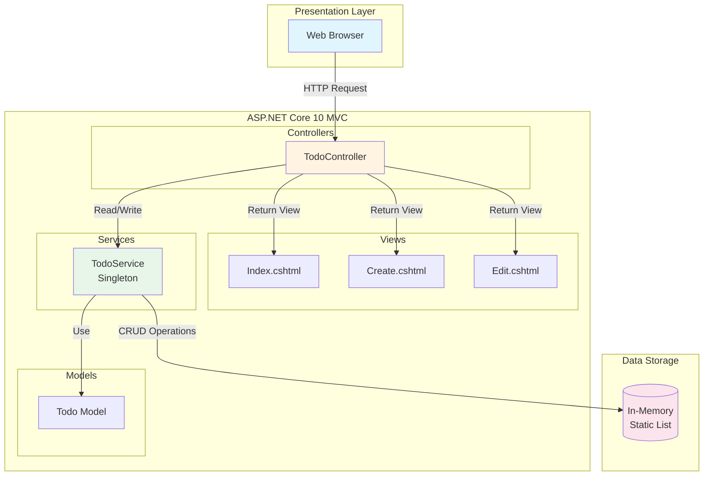

## 應用程式元件圖 (Application Component Diagram)

```mermaid
graph LR
    subgraph "Todo Model"
        TM[Todo<br/>+Id: int<br/>+Title: string<br/>+Description: string<br/>+IsCompleted: bool<br/>+CreatedAt: DateTime]
    end
    
    subgraph "TodoService"
        TS[TodoService<br/>-_todos: List&lt;Todo&gt;<br/>-_nextId: int<br/>-_lock: object<br/>+GetAll&#40;&#41;<br/>+GetById&#40;int&#41;<br/>+Add&#40;Todo&#41;<br/>+Update&#40;Todo&#41;<br/>+Delete&#40;int&#41;<br/>+ToggleComplete&#40;int&#41;]
    end
    
    subgraph "TodoController"
        TC[TodoController<br/>-_todoService<br/>+Index&#40;&#41;<br/>+Create&#40;&#41;<br/>+Create&#40;Todo&#41;<br/>+Edit&#40;int&#41;<br/>+Edit&#40;int, Todo&#41;<br/>+Delete&#40;int&#41;<br/>+Toggle&#40;int&#41;]
    end
    
    TC -->|Uses| TS
    TS -->|Manages| TM
    
    style TM fill:#e3f2fd
    style TS fill:#f3e5f5
    style TC fill:#fff9c4
```

## CRUD 操作流程圖 (CRUD Operation Flow)

### 1. 查看所有待辦事項 (View All Todos - Index)

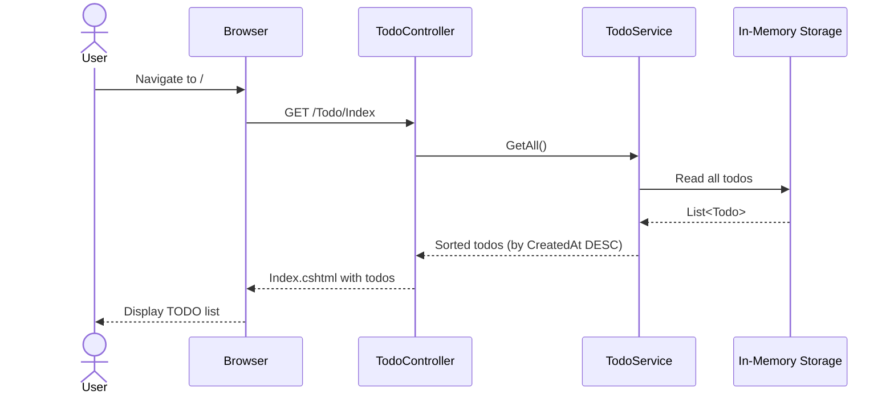

### 2. 新增待辦事項 (Create Todo)

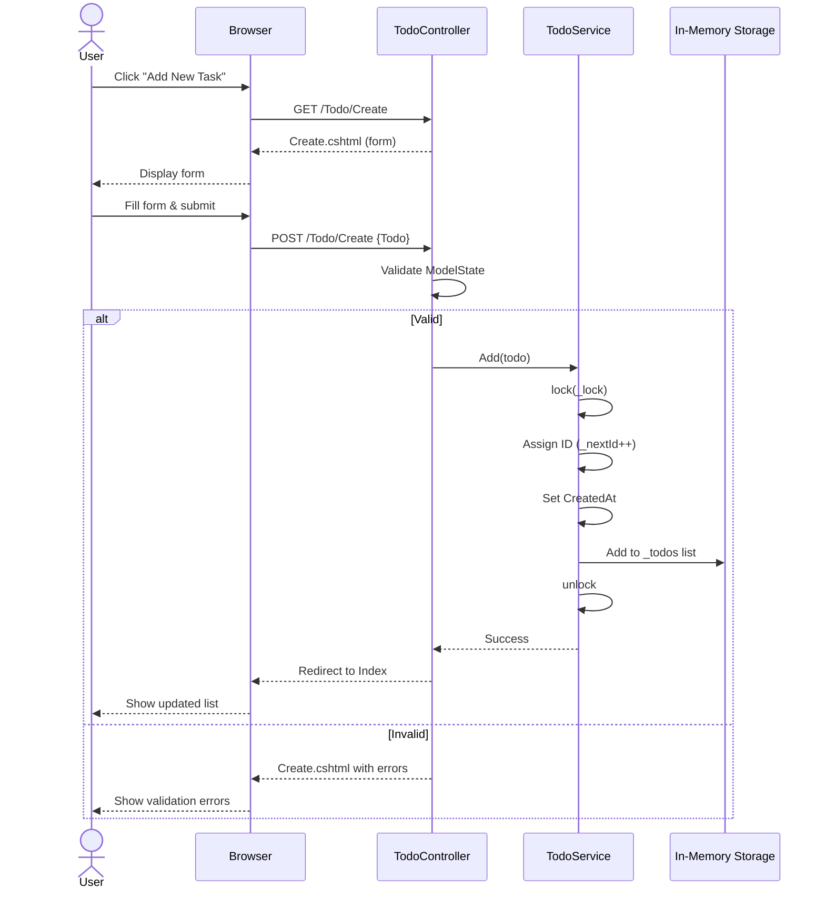

### 3. 編輯待辦事項 (Edit Todo)

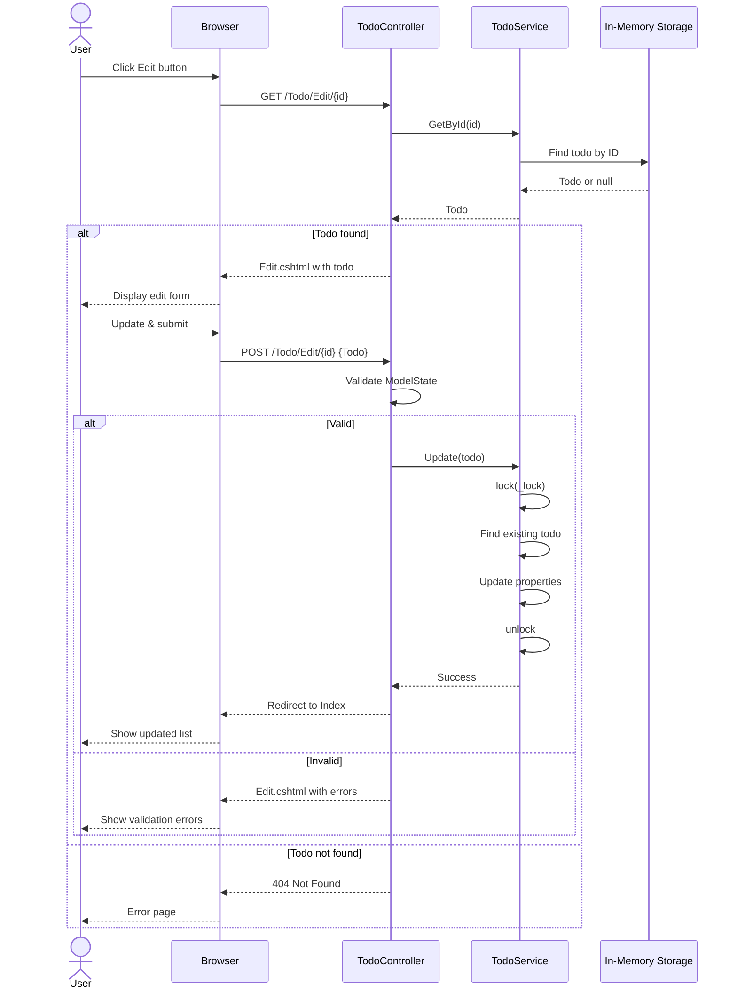

### 4. 刪除待辦事項 (Delete Todo)

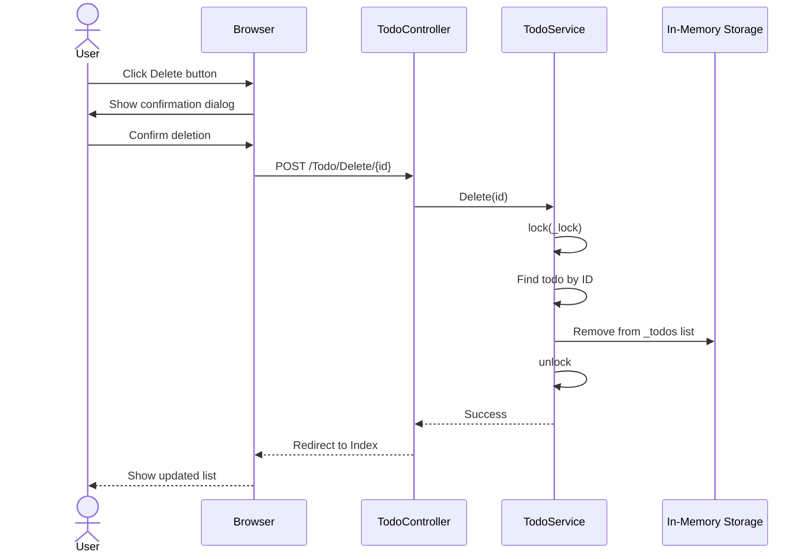

### 5. 切換完成狀態 (Toggle Completion Status)

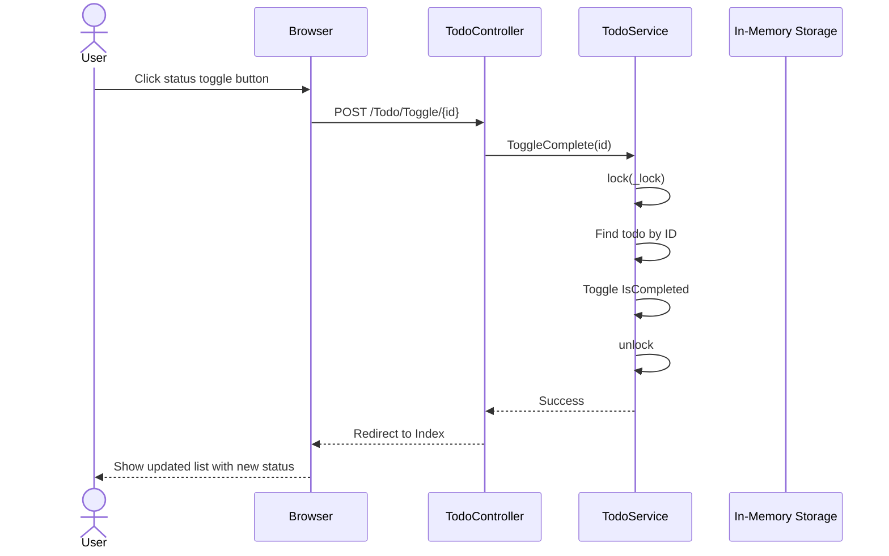

## 資料流程圖 (Data Flow Diagram)

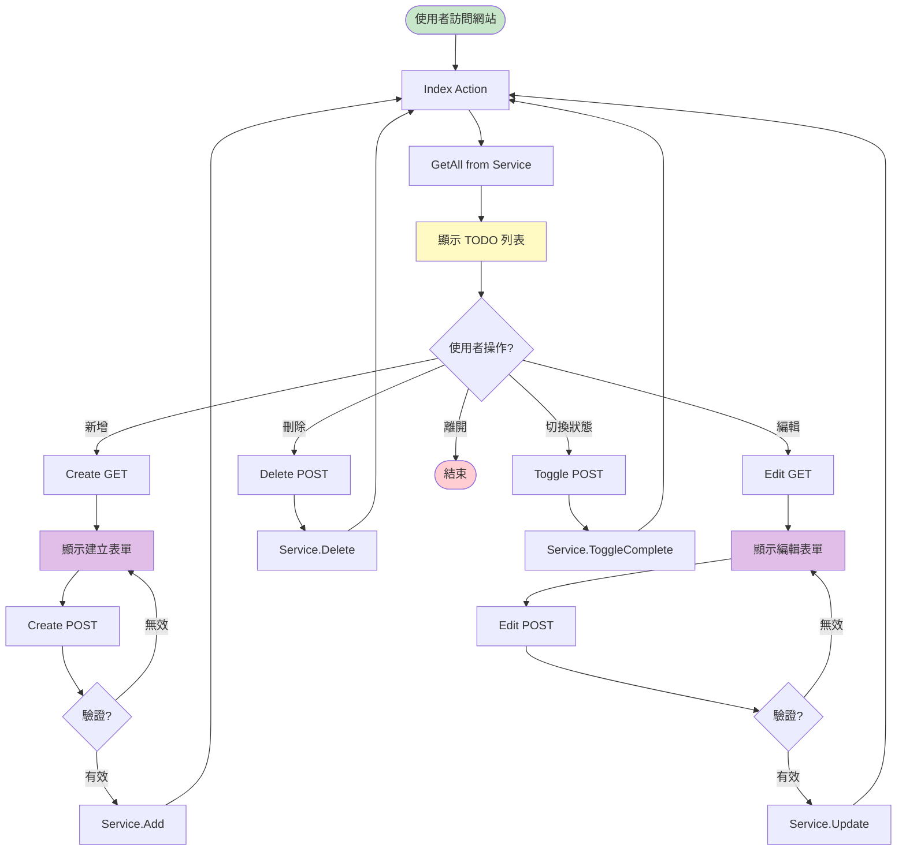

## 執行緒安全機制 (Thread Safety Mechanism)

```mermaid
graph TD
    subgraph "TodoService - Thread Safe Operations"
        Lock[_lock object]
        
        subgraph "Add Method"
            A1[lock&#40;_lock&#41;] --> A2[Assign _nextId++]
            A2 --> A3[Set CreatedAt]
            A3 --> A4[Add to _todos]
            A4 --> A5[unlock]
        end
        
        subgraph "Update Method"
            U1[lock&#40;_lock&#41;] --> U2[Find existing]
            U2 --> U3[Update properties]
            U3 --> U4[unlock]
        end
        
        subgraph "Delete Method"
            D1[lock&#40;_lock&#41;] --> D2[Find todo]
            D2 --> D3[Remove from _todos]
            D3 --> D4[unlock]
        end
        
        subgraph "Toggle Method"
            T1[lock&#40;_lock&#41;] --> T2[Find todo]
            T2 --> T3[Toggle IsCompleted]
            T3 --> T4[unlock]
        end
        
        Lock -.-> A1
        Lock -.-> U1
        Lock -.-> D1
        Lock -.-> T1
    end
    
    style Lock fill:#ffeb3b
    style A1 fill:#c8e6c9
    style U1 fill:#c8e6c9
    style D1 fill:#c8e6c9
    style T1 fill:#c8e6c9
```

## 技術堆疊 (Technology Stack)

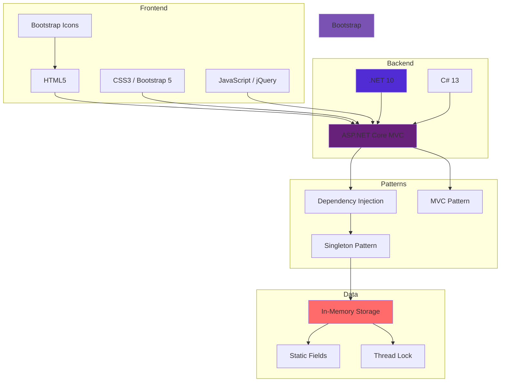

## 部署流程 (Deployment Flow)

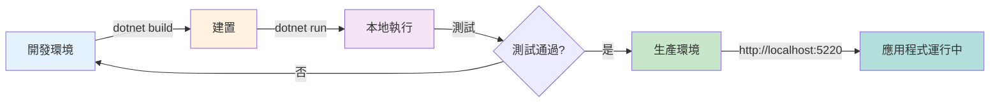

## 注意事項 (Important Notes)

### 資料持久性 (Data Persistence)
- ⚠️ 目前使用 **In-Memory** 儲存
- 應用程式重啟後資料會遺失
- 生產環境建議使用：
  - SQL Server
  - PostgreSQL
  - SQLite
  - Entity Framework Core

### 執行緒安全 (Thread Safety)
- ✅ 所有寫入操作使用 `lock(_lock)` 保護
- ✅ 防止並發存取衝突
- ✅ 確保 ID 生成的原子性

### 擴展性建議 (Scalability Recommendations)
1. 實作資料庫持久化層
2. 加入身份驗證與授權
3. 實作 RESTful API
4. 加入單元測試與整合測試
5. 實作日誌記錄機制
